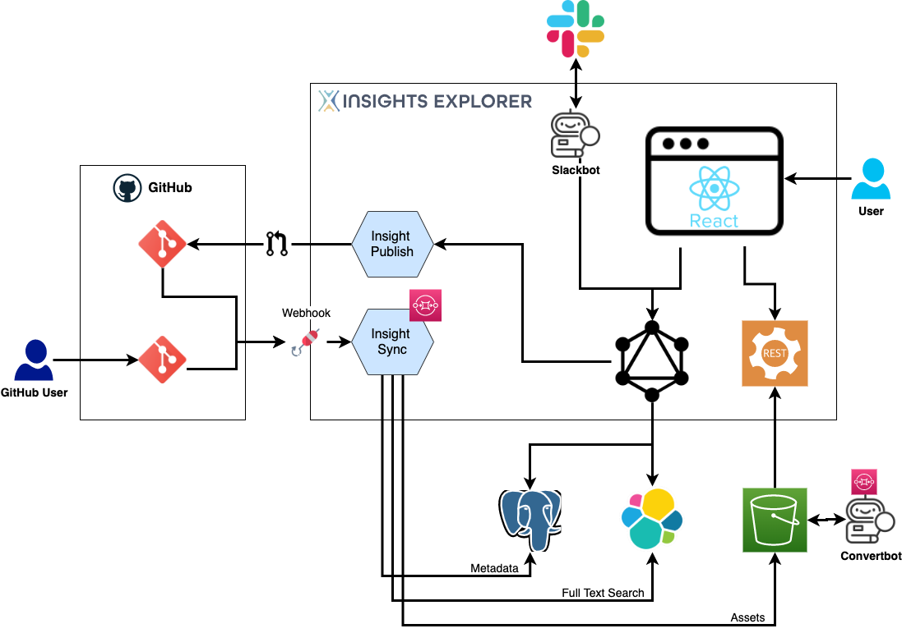
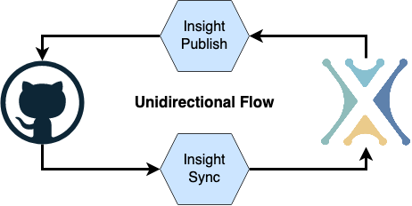

# IEX Architecture

## High-Level Architecture

Insights Explorer (IEX) is a service that makes it easy to document, edit, and view analytical insights.

Those Insights are persisted in git repositories in GitHub, so the two main data flows involve publishing Insights to GitHub, and syncing Insights from GitHub.  This is a unidirectional process as illustrated below:

This approach treats changes made through IEX identically to out-of-band changes directly made in GitHub.  Any changes to the Insight repository will be synced similarly into IEX.  While this approach is less efficient than directly publishing changes into IEX, it simplifies the overall process and avoids synchronization issues.

## Components

| Component | Description |
| --------- | ----------- |
| IEX Service | Contains the backend, APIs, and hosts the frontend |
| Convertbot | Converts s3 files to different formats; listens to an SQS queue |
| Slackbot | Provides URL unfurling, using the IEX GraphQL API |
| PostgreSQL | Relational data store |
| Elasticsearch | Document store providing search capabilities |
| S3 | Asset storage, including Insight contents & user avatar images |
| SQS | Message queue used to communicate between various components |
| GitHub | System of record for Insight contents |
| Okta | Auth provider |

