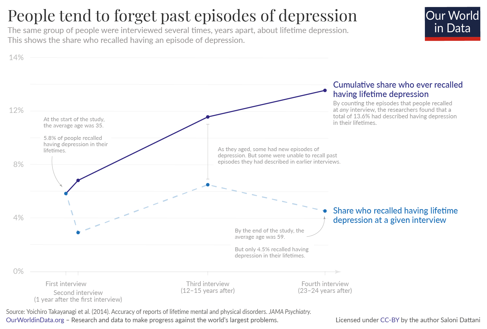
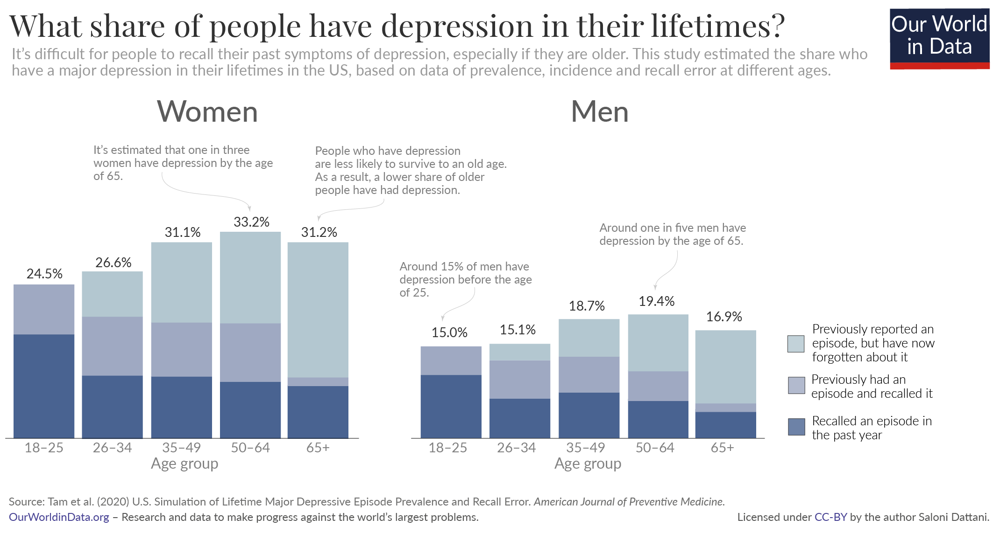

# What is the lifetime risk of depression?

Depression is one of the world’s most common health conditions. It’s estimated that one-in-three women and one-in-five men have an episode of major depression by the age of 65.

**by Saloni Dattani**
 
May 18, 2022

Depression is one of the most common health conditions globally. It’s estimated that between [two to six percent](https://ourworldindata.org/mental-health#depression) of people in the world have experienced depression in the past year.[^1]

But what are the chances that people have depression at any time in their lives?

This question is difficult to answer because depression is not a constant condition – people tend to transition in and out of depressive episodes. The chances of ever having an episode of depression are therefore much higher than the figure of two to six percent.

Researchers estimate that around one in three women and one in five men in the United States have an episode of major depression by the time they are 65.[^2] Studies in other high-income countries suggest even higher figures. In the Netherlands and Australia, it’s estimated that this affects 40% of women and 30% of men.[^3]

In this post, I will explain why measuring the lifetime risk of depression can be challenging, and how researchers are able to address the challenges and estimate the risk of major depression over a person’s lifetime.[^4]

## Challenges in measuring lifetime depression

One way to estimate the lifetime risk of depression is to ask elderly people whether they have ever had depression in their lives. This sounds straightforward, but it leads to several problems.

One is that it relies on self-reporting. Major depression is diagnosed based on the symptoms that people report to a professional. Since some are unwilling to share these symptoms, we would underestimate the risk of depression if we relied on this information alone.[^5]

This is particularly important for older generations, who lived much of their lives at a time when recognition and acceptance of mental illness was lower. That relates to a second problem: people from different generations might be less willing to report symptoms.[^6]

Another issue is that getting these estimates on a global level is difficult because this data is lacking across many countries. This is especially true for low-income countries.[^7] For example, the Global Burden of Disease study finds that only a quarter of countries and territories had direct data on the prevalence of major depression between 2005 and 2015.[^8]

This means our findings mostly come from a small number of high-income countries where these studies have been done.

But even in countries where the data does exist, there is yet another major challenge. People often forget about previous episodes of depression – especially if they happened a long time ago. This is called ‘recall bias’, and it is one more problem that makes it hard to rely on people’s self-report of symptoms of depression.

You can see this in the chart. This comes from a large study of people who were interviewed several times, years apart, about symptoms of mental and physical illness they had in their lives.[^9]

Some people described having an episode of depression between one interview and the next. But some failed to recall episodes that they described in earlier interviews. This led to a more or less constant share who described lifetime depression at each interview.

As we might expect, older people were much more likely to forget previous symptoms. People older than 60 were around seven times more likely to forget past episodes than those under 50.

This means we need to be cautious when using data from surveys – without adjusting for this recall bias, we would underestimate the lifetime risk of depression.[^10]
Lifetime depression recall bias

## Estimating the lifetime risk of depression

To avoid these problems, researchers can use models to estimate the risk of depression over a person’s lifetime.

They can look at the ages of the people who described an episode of depression in the past year and use this age profile to estimate the cumulative risk over time.[^11]

Studies that used this approach have estimated that the risk of depression by the age of 75 was 30% in the United States in 2005.[^12]

Researchers can also estimate the lifetime risk by estimating the share who have forgotten a past episode of depression. A study by Jamie Tam and colleagues used this approach with more recent data.[^13] They did this based on people’s self-reports of depression in the past year and in their lifetimes, along with the rates of recall error.

You can see this in the chart. The researchers estimated that one in three women (33%) and one in five men (19%) have major depression by the age of 65 in the United States. With age, the share who have had an episode in the past year declines only slightly. But the share who have forgotten earlier episodes increases steeply.

After the age of 65, the rates of lifetime depression declines, because people who have had depression are less likely to survive to an older age.[^14]

There are also estimates from other high-income countries. For example, a 2005 study that used data from the Netherlands and Australia estimated that 40% of women and 30% of men have an episode of major depression by the age of 65, after correcting for biases.[^15]

What all of these studies agree on is that the lifetime risk of depression is high, and far higher than the estimates made from asking elderly people to recall depression in their lives.

The significant risk of depression over a lifetime is a major reason why it is important to understand, recognize and address. Depression is not uncommon, and people who experience it are not alone.

Yet the risk is not fixed over time. Depression is not inevitable or irreversible. We can strive to prevent it and the impact it has on those who face it.

----

Acknowledgements: I would like to thank Hannah Ritchie, Max Roser, Nathaniel Bechhofer, Bastian Herre and Lars Yencken for reading drafts of this post and their very helpful suggestions to improve it.

----

##### Reuse our work freely

All visualizations, data, and code produced by Our World in Data are completely open access under the [Creative Commons BY license](https://creativecommons.org/licenses/by/4.0/). You have the permission to use, distribute, and reproduce these in any medium, provided the source and authors are credited.

The data produced by third parties and made available by Our World in Data is subject to the license terms from the original third-party authors. We will always indicate the original source of the data in our documentation, so you should always check the license of any such third-party data before use and redistribution.

All of [our charts can be embedded](https://ourworldindata.org/how-to-use-our-world-in-data#how-to-embed-interactive-charts-in-your-article) in any site.

<!-- Endnotes -->

[^1]: Note that the Global Burden of Disease study found that only a quarter of geographies had primary data on the prevalence of major depression between 2005 and 2015.   Vos, T., Allen, C., Arora, M., Barber, R. M., Bhutta, Z. A., Brown, A., Carter, A., Casey, D. C., Charlson, F. J., Chen, A. Z., Coggeshall, M., Cornaby, L., Dandona, L., Dicker, D. J., Dilegge, T., Erskine, H. E., Ferrari, A. J., Fitzmaurice, C., Fleming, T., … Murray, C. J. L. (2016). Global, regional, and national incidence, prevalence, and years lived with disability for 310 diseases and injuries, 1990–2015: A systematic analysis for the Global Burden of Disease Study 2015. The Lancet, 388(10053), 1545–1602. Appendix: page 665. https://doi.org/10.1016/S0140-6736(16)31678-6

[^2]: A large share of the population in these countries is older than 65 years old, and studies suggest that depression becomes more common in late life. See: Luppa, M., Sikorski, C., Luck, T., Ehreke, L., Konnopka, A., Wiese, B., Weyerer, S., König, H.-H., & Riedel-Heller, S. G. (2012). Age- and gender-specific prevalence of depression in latest-life – Systematic review and meta-analysis. Journal of Affective Disorders, 136(3), 212–221. https://doi.org/10.1016/j.jad.2010.11.033. However, the studies modeling lifetime risk tend to not make estimates for older age groups.

[^3]: Kruijshaar, M. E., Barendregt, J., Vos, T., de Graaf, R., Spijker, J., & Andrews, G. (2005). Lifetime prevalence estimates of major depression: An indirect estimation method and a quantification of recall bias. European Journal of Epidemiology, 20(1), 103–111. https://doi.org/10.1007/s10654-004-1009-0

[^4]: An episode of major depression is defined by diagnostic manuals as the following – feeling sadness or a pronounced loss of interest for at least two weeks, along with at least five of these symptoms: fatigue, trouble concentrating, feeling excessive guilt, thoughts of death or suicide, and changes in appetite, sleep or movement.   American Psychiatric Association. (2013). Diagnostic and Statistical Manual of Mental Disorders (Fifth Edition). American Psychiatric Association. https://doi.org/10.1176/appi.books.9780890425596   World Health Organization (Ed.). (2004). International statistical classification of diseases and related health problems (10th revision, 2nd edition). World Health Organization.   Throughout this post, I refer to studies of the general population which used structured interviews to determine whether people had an episode of major depression to a level of a clinical diagnosis. This is important because other tools (such as screening questionnaires) to measure depression are considered less reliable; they also tend to find far higher estimates of prevalence. See: Levis, B., Yan, X.W., He, C. et al. Comparison of depression prevalence estimates in meta-analyses based on screening tools and rating scales versus diagnostic interviews: a meta-research review. BMC Med 17, 65 (2019). https://doi.org/10.1186/s12916-019-1297-6   Episodes of major depression can occur in three different conditions: major depressive disorder, persistent depressive disorder and bipolar disorder. However, most episodes of major depression occur in major depressive disorder, which is 9–10x more common than bipolar disorder. This post looks at episodes of major depression overall, which can occur in any of these disorders.   For estimates of the risk of depression in major depressive disorder versus bipolar disorder, see: Beesdo, K., Höfler, M., Leibenluft, E., Lieb, R., Bauer, M., & Pfennig, A. (2009). Mood episodes and mood disorders: Patterns of incidence and conversion in the first three decades of life. Bipolar Disorders, 11(6), 637–649. https://pubmed.ncbi.nlm.nih.gov/19689506/

[^5]: Mars, B., Cornish, R., Heron, J., Boyd, A., Crane, C., Hawton, K., Lewis, G., Tilling, K., Macleod, J., & Gunnell, D. (2016). Using Data Linkage to Investigate Inconsistent Reporting of Self-Harm and Questionnaire Non-Response. Archives of Suicide Research, 20(2), 113–141. https://doi.org/10.1080/13811118.2015.1033121   Jousilahti, P. (2005). Total and cause specific mortality among participants and non-participants of population based health surveys: A comprehensive follow up of 54 372 Finnish men and women. Journal of Epidemiology & Community Health, 59(4), 310–315. https://doi.org/10.1136/jech.2004.024349   Williams, D., & Brick, J. M. (2018). Trends in U.S. Face-To-Face Household Survey Nonresponse and Level of Effort. Journal of Survey Statistics and Methodology, 6(2), 186–211. https://doi.org/10.1093/jssam/smx019

[^6]: Schomerus, G., Schwahn, C., Holzinger, A., Corrigan, P. W., Grabe, H. J., Carta, M. G., & Angermeyer, M. C. (2012). Evolution of public attitudes about mental illness: A systematic review and meta-analysis: Evolution of public attitudes. Acta Psychiatrica Scandinavica, 125(6), 440–452. https://doi.org/10.1111/j.1600-0447.2012.01826.x   Angermeyer, M. C., Matschinger, H., & Schomerus, G. (2013). Attitudes towards psychiatric treatment and people with mental illness: changes over two decades. The British Journal of Psychiatry, 203(2), 146-151.

[^7]: Ferrari, A. J., Somerville, A. J., Baxter, A. J., Norman, R., Patten, S. B., Vos, T., & Whiteford, H. A. (2013). Global variation in the prevalence and incidence of major depressive disorder: A systematic review of the epidemiological literature. Psychological Medicine, 43(3), 471–481. https://doi.org/10.1017/S0033291712001511   Steel, Z., Marnane, C., Iranpour, C., Chey, T., Jackson, J. W., Patel, V., & Silove, D. (2014). The global prevalence of common mental disorders: A systematic review and meta-analysis 1980–2013. International Journal of Epidemiology, 43(2), 476–493. https://doi.org/10.1093/ije/dyu038

[^8]: Vos, T., Allen, C., Arora, M., Barber, R. M., Bhutta, Z. A., Brown, A., Carter, A., Casey, D. C., Charlson, F. J., Chen, A. Z., Coggeshall, M., Cornaby, L., Dandona, L., Dicker, D. J., Dilegge, T., Erskine, H. E., Ferrari, A. J., Fitzmaurice, C., Fleming, T., … Murray, C. J. L. (2016). Global, regional, and national incidence, prevalence, and years lived with disability for 310 diseases and injuries, 1990–2015: A systematic analysis for the Global Burden of Disease Study 2015. The Lancet, 388(10053), 1545–1602. Appendix: page 665. https://doi.org/10.1016/S0140-6736(16)31678-6

[^9]: Takayanagi, Y., Spira, A. P., Roth, K. B., Gallo, J. J., Eaton, W. W., & Mojtabai, R. (2014). Accuracy of Reports of Lifetime Mental and Physical Disorders: Results From the Baltimore Epidemiological Catchment Area Study. JAMA Psychiatry, 71(3), 273. https://www.ncbi.nlm.nih.gov/pmc/articles/PMC4135054/

[^10]: Kessler, R. C., Petukhova, M., Sampson, N. A., Zaslavsky, A. M., & Wittchen, H.-U. (2012). Twelve-month and lifetime prevalence and lifetime morbid risk of anxiety and mood disorders in the United States. International Journal of Methods in Psychiatric Research, 21(3), 169–184.   Moffitt, T. E., Caspi, A., Taylor, A., Kokaua, J., Milne, B. J., Polanczyk, G., & Poulton, R. (2010). How common are common mental disorders? Evidence that lifetime prevalence rates are doubled by prospective versus retrospective ascertainment. Psychological Medicine, 40(6), 899–909. https://doi.org/10.1017/S0033291709991036

[^11]: This is similar to the way period life expectancy is calculated.

[^12]: Kessler, R. C., Petukhova, M., Sampson, N. A., Zaslavsky, A. M., & Wittchen, H.-U. (2012). Twelve-month and lifetime prevalence and lifetime morbid risk of anxiety and mood disorders in the United States. International Journal of Methods in Psychiatric Research, 21(3), 169–184.  
This method is also useful because people are less likely to forget episodes that occurred in the past year than those that happened years ago. This study did not include estimates by gender.

[^13]:Tam, J., Mezuk, B., Zivin, K., & Meza, R. (2020). U.S. Simulation of Lifetime Major Depressive Episode Prevalence and Recall Error. American Journal of Preventive Medicine, 59(2), e39–e47. https://www.ncbi.nlm.nih.gov/pmc/articles/PMC7375917/  
The code for this study is available at https://github.com/jamietam/dep-model-AJPM/ where you can download the data, simulate how health interventions may change the risk of lifetime depression, and more.

[^14]: Walker, E. R., McGee, R. E., & Druss, B. G. (2015). Mortality in Mental Disorders and Global Disease Burden Implications: A Systematic Review and Meta-analysis. JAMA Psychiatry, 72(4), 334. https://doi.org/10.1001/jamapsychiatry.2014.2502

[^15]: Kruijshaar, M. E., Barendregt, J., Vos, T., de Graaf, R., Spijker, J., & Andrews, G. (2005). Lifetime prevalence estimates of major depression: An indirect estimation method and a quantification of recall bias. European Journal of Epidemiology, 20(1), 103–111. https://link.springer.com/article/10.1007/s10654-004-1009-0
