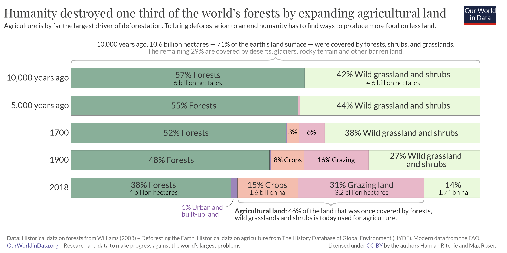
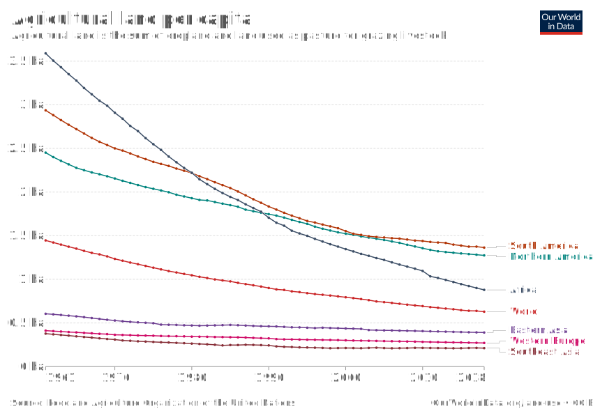

# The world has lost one-third of its forest, but an end of deforestation is possible

Over the last 10,000 years the world has lost one-third of its forests. An area twice the size of the United States. Half occurred in the last century.

**by Hannah Ritchie**
 
February 09, 2021

> **
Summary
**
> Shortly after the end of the last great ice age – 10,000 years ago – 57% of the world's habitable land was covered by forest. In the millennia since then a growing demand for agricultural land means we've lost one-third of global forests – an area twice the size of the United States. Half of this loss occurred in the last century alone. But it's possible to end our long history of deforestation: increased crop yields, improved livestock productivity, and technological innovations that allow us to shift away from land-intensive food products gives us the opportunity to bring deforestation to an end and restore some of the forest we have lost.

**Update**: _In February 2022, this article was updated with an improved version of the long-run chart on global forest loss. You can find the previous version [here][previous-chart]._

[previous-chart]: https://ourworldindata.org/uploads/2021/02/Long-term-change-in-land-use.png

---

Many people think of environmental concerns as a modern issue: humanity's destruction of nature and ecosystems as a result of very recent [population growth](https://ourworldindata.org/world-population-growth) and [increasing consumption](https://ourworldindata.org/economic-growth). This is true for some problems, such as climate change. But it's not the case for deforestation. Humans have been cutting down trees for millennia.

How much forest has the world lost? When in history did we lose it?

In the chart we see how the cover of the earth's surface has changed over the past 10,000 years. This is shortly after the end of the last great ice age, through to the present day.[^1]

Let's start at the top. You see that of the 14.9 billion hectares of land on the planet, only 71% of it is habitable – the other 29% is either covered by ice and glaciers, or is barren land such as deserts, salt flats, or dunes. I have therefore excluded these categories so we can focus on how habitable land is used.

The bar chart just below shows the earth's surface cover just after the end of the last ice age.[^2] 10,000 years ago 57% of the world's habitable land was covered by forest. That's [6 billion hectares](https://www.un.org/development/desa/en/news/forest/international-day-forests-2018.html).  Today, only 4 billion hectares are left. The world has lost one-third of its forest – an area twice the size of the United States.

Only 10% of this was lost in the first half of this period, until 5,000 years ago. The global population at this time was small and growing very slowly – there were [fewer than 50 million people](https://ourworldindata.org/grapher/world-population-1750-2015-and-un-projection-until-2100) in the world. The amount of [land per person](https://ourworldindata.org/grapher/total-agricultural-land-use-per-person?time=earliest..2016) that was needed to produce enough food was not small – in fact, it was much larger than today. But a small global population overall meant there was little pressure on forests to make space for land to grow food, and as wood for energy.

If we fast-forward to 1700 when the global population [had increased](https://ourworldindata.org/grapher/world-population-1750-2015-and-un-projection-until-2100) more than ten-fold, to 603 million. The amount of land used for agriculture – land to grow crops as well as grazing land for livestock – was expanding. You will notice in the chart that this was not only expanding into previously forested land, but also other land uses such as wild grasslands and shrubbery. Still, more than half of the world's habitable land was forested.

The turn of the 20th century is when global forest loss reached the halfway point: half of total forest loss occurred from 8,000BC to 1900; the other half occurred in the last century alone. This emphasises two important points.

First, it reiterates that deforestation is not a new problem: relatively small populations of the past were capable of driving a large amount of forest loss. By 1900, there were 1.65 billion people in the world (five times fewer than we have today) but for most of the previous period, humans were deforesting the world with only tens or hundreds of millions. Even with the most basic of lifestyles compared to today's standards, the per capita footprint of our ancestors would have been large. Low agricultural productivity and a reliance on wood for fuel meant that large amounts of land had to be cleared for basic provisions.

Second, it makes clear how much deforestation accelerated over the last century. In just over 100 years the world lost as much forest as it had in the previous 9,000 years. An area the size of the United States. From the chart we see that this was driven by the continued expansion of land for agriculture. When we think of the growing pressures on land from modern populations we often picture sprawling megacities. But urban land accounts for just 1% of global habitable land. Humanity's biggest footprint is due to what we eat, not where we live.

## How can we put an end to our long history of deforestation?

This might paint a bleak picture for the future of the world's forests: the United Nations projects that the [global population will continue to grow](https://ourworldindata.org/world-population-growth#two-centuries-of-rapid-global-population-growth-will-come-to-an-end), reaching 10.8 billion by 2100. But there are real reasons to believe that this century doesn't have to replicate the destruction of the last one.

The world passed 'peaked deforestation' in the 1980s and it has been on the decline since then – we take a look at rates of forest loss since 1700 in our follow-up post. Improvements in [crop yields](https://ourworldindata.org/crop-yields) mean the per capita demand for agricultural land continues to fall. We see this in the chart. Since 1961, the amount of land we use for agriculture [increased by only 7%](https://ourworldindata.org/grapher/agricultural-land?tab=chart&stackMode=relative&region=World). Meanwhile, the global [population increased](https://ourworldindata.org/grapher/population?time=1961..2018&country=~OWID_WRL) by 147% – from 3.1 to 7.6 billion.[^3] This means that agricultural land per person more than halved, from 1.45 to 0.63 hectares.

In fact, the world [may have already passed](https://ourworldindata.org/grapher/agricultural-land?tab=chart&stackMode=absolute&region=World) 'peak agricultural land' _[we will look at this in more detail in an upcoming post]_. And with the growth of technological innovations such as lab-grown meat and substitute products, there is the real possibility that we can continue to enjoy meat or meat-like foods while freeing up the massive amounts of land we use to raise livestock.

If we can take advantage of these innovations, we can bring deforestation to an end. A future with more people and more forest is possible.

----

Our World in Data presents the data and research to make progress against the world’s largest problems.
This blog post draws on data and research discussed in our entry on [Forests and Deforestation](https://ourworldindata.org/forests-and-deforestation).

----

##### Reuse our work freely

All visualizations, data, and code produced by Our World in Data are completely open access under the [Creative Commons BY license](https://creativecommons.org/licenses/by/4.0/). You have the permission to use, distribute, and reproduce these in any medium, provided the source and authors are credited.

The data produced by third parties and made available by Our World in Data is subject to the license terms from the original third-party authors. We will always indicate the original source of the data in our documentation, so you should always check the license of any such third-party data before use and redistribution.

All of [our charts can be embedded](https://ourworldindata.org/how-to-use-our-world-in-data#how-to-embed-interactive-charts-in-your-article) in any site.

<!-- Endnotes -->

[^1]: The data used in this chart comes from several sources.

    **Forests:** this data is primarily sourced from the UN Food and Agriculture Organization (FAO). It provides [long-term estimates](https://www.un.org/development/desa/en/news/forest/international-day-forests-2018.html) on forest cover in 10,000 and 5,000 years BP. Its State of the World’s Forests report provides estimates of global forest cover today, and rates of change over previous decades. In a related post we have combined this FAO data with global deforestation rates from Williams (2003) to document forest change over the last 300 years – this gives us data on forest change from 1700 onwards.

    The definition of 'forest’ can vary depending on aspects such as tree density and height. Absolute estimates of forest cover from other sources may differ for this reason. However, most align on the relative change in forests over this period. For example, Ellis et al. (2020). estimate a 35% loss of global forest cover since 10,000. This is very close to our estimate of a one-third loss.

    **Agricultural and urban land:** The UN FAO Statistical database provides data on global agricultural and urban land from 1961 onwards. Pre-1961 land use is sourced from the work of Ellis et al. (2020).

    **References:**   FAO and UNEP. 2020. The State of the World’s Forests 2020. Forests, biodiversity and people. Rome.

    Williams, M. (2003). Deforesting the earth: from prehistory to global crisis. University of Chicago Press.

    Ellis, E. C., Beusen, A. H., & Goldewijk, K. K. (2020). [Anthropogenic Biomes: 10,000 BCE to 2015 CE](https://www.mdpi.com/2073-445X/9/5/129). Land, 9(5), 129.

[^2]: Estimates vary, but most date the end of the last great ice age to around 11,700 years ago.

    Kump, L. R., Kasting, J. F., & Crane, R. G. (2004). [The Earth System (Vol. 432)](https://www.sciencedirect.com/science/article/pii/B9780127329512500077). Upper Saddle River, NJ: Pearson Prentice Hall.

[^3]: We can calculate this increase as [(7.63 billion – 3.09 billion) / 3.09 billion * 100 = 147%].
